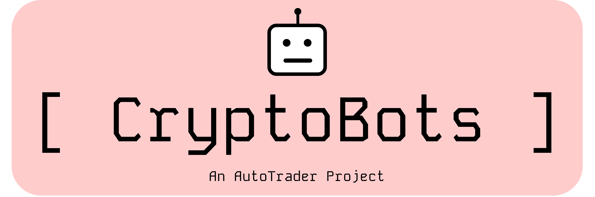

<a name="readme-top"></a>



Don't pay for a crypto algo-trading service when you can do the same thing for free 
with CryptoBots! CryptoBots is an open-source Python package with pre-built trading 
strategies ready to be deployed on your favourite crypto exchanges.
It is built on [AutoTrader](https://github.com/kieran-mackle/AutoTrader).


## Trading Strategies
CryptoBots currently includes the strategies listed below. Stay tuned - more will be added
regularly.

<details>
  <summary><b>EMA crossover trading bot</b></summary>
    This bot will trade trends by using the EMA crossover strategy. Below are some backtest
    results on ETH.

    ----------------------------------------------
                  Trading Results
    ----------------------------------------------
    Start date:              Jan 01 2024 01:00:00
    End date:                Mar 04 2024 00:00:00
    Duration:                62 days 23:00:00
    Starting balance:        $1000.0
    Ending balance:          $1034.91
    Ending NAV:              $1036.92
    Total return:            $34.91 (3.5%)
    Maximum drawdown:        -1.86%
    Total no. trades:        40
    No. long trades:         20
    No. short trades:        20
    Total fees paid:         $0.0
    Total volume traded:     $4021.61
    Average daily volume:    $64.86
    Positions still open:    1
</details>

<details>
  <summary><b>Grid Bot</b></summary>
    This bot will buy and/or sell at set grid levels. When you expect market conditions
    to be choppy and sideways-moving, a long/short grid works best. In this scenario, the
    bot will buy when price dips, and sell when price rises. When you expect the market to
    be trending (up or down!), a one-directional grid works best. In this case, the bot 
    will act as a trend-follower with a trailing stop loss at each new grid level.
    Below is a backtest result from running the grid bot in long trend mode on ETH/USDT 
    perpetual from February 1st to March 9th 2024.

    ----------------------------------------------
                  Trading Results
    ----------------------------------------------
    Start date:              Feb 01 2024 00:01:00
    End date:                Mar 09 2024 00:00:00
    Duration:                36 days 23:59:00
    Starting balance:        $1000.0
    Ending balance:          $1243.92
    Ending NAV:              $1242.28
    Total return:            $243.92 (24.4%)
    Maximum drawdown:        -13.12%
    Total no. trades:        238
    No. long trades:         120
    No. short trades:        118
    Total fees paid:         $0.0
    Total volume traded:     $34782.46
    Average daily volume:    $966.18

</details>

<details>
  <summary><b>TWAP Bot</b></summary>
    This bot will buy a chunk of tokens every update period until the
    target position is reached. Useful for splitting up a large position
    into smaller trades to avoid slippage.
</details>


### Coming Soon
The following strategies will be added soon.

<details>
  <summary><b>Mean reversion bot</b></summary>
    This bot will use limit orders to trade around a mean price, capturing market fluctuations.
</details>

<details>
  <summary><b>Cash and carry bot</b></summary>
    This bot will find the best cash and carry opportunities, where there is a high funding rate
    on a perpetual market to be earnt.
</details>


<p align="right">[<a href="#readme-top">back to top</a>]</p>


## Featured Exchanges

CryptoBots has been tested on the following exchanges. It *should* work on others too, but I am
yet to do extensive testing on them. More will be added soon!

| Exchange | Referral code |
| -------- | ------------- |
| [Bybit](https://www.bybit.com/invite?ref=7NDOBW)    | 7NDOBW |
<!-- | [OKX](https://www.okx.com/join/52421048) | 52421048 | -->
<!-- | [KuCoin](https://www.kucoin.com/r/rf/QBSFBCDM) | QBSFBCDM | -->


<p align="right">[<a href="#readme-top">back to top</a>]</p>


## Getting Started
### Installation
CryptoBots can be installed from [PyPi](https://pypi.org/project/cryptobots) using `pip install`:

```
pip install cryptobots
```

Once installed, you will have access to the `cryptobots` command line interface. See the usage 
guide below for more.


### Usage
CryptoBots is primarily a command-line based tool. Once installed, you will be able to use the
`cryptobots` command line interface from your terminal.
If you type `cryptobots`, you will see a list of commands available.

**Configuration**

The first thing you want to do is run `cryptobots configure`, which will set up your cryptobots
home directory and prompt you to add your exchange API keys. You need to do this before you can
trade.

**Available strategies**

To see the strategies cryptobots has available, run the `cryptobots strategies` command. This
will list all available strategies and give you a description of what each one does.

**Deploying a strategy**

To deploy a strategy, use the `cryptobots run` command, and follow the prompts.


**Stopping a strategy**

To stop a strategy, use the `cryptobots stop` command, and follow the prompts.


**Backtesting a strategy**

To backtest a strategy, use the `cryptobots backtest` command, and follow the prompts.


<p align="right">[<a href="#readme-top">back to top</a>]</p>


## Frequently asked questions

Below are some common questions you might have about Cryptobots.
If you have any other questions, feel free to raise an issue.

<details>
  <summary><b>Why should I use cryptobots?</b></summary>
Cryptobots has been designed to be as easy to use as possible. If you want to start
trading crypto but aren't sure where to start, Cryptobots is for you. If you want to
start algotrading, Cryptobots is for you. If you already know how to trade and how to 
write Python code, Cryptobots is for you - it is easy to add your own strategy.
</details>

<details>
  <summary><b>Do I need to know how to code?</b></summary>
No! The trading strategies have been written for you! Simply deploy them using the 
command line interface as shown in the demo above.
</details>

<details>
  <summary><b>Where should I run ryptobots?</b></summary>
You can run cryptobots on any regular computer - you just need to have Python installed.
</details>

<details>
  <summary><b>Are my API keys safe?</b></summary>
Yes! When you set up `cryptobots` and enter your exchange API keys, they get
stored on your computer in the `.cryptobots/` folder of your home directory (unless 
you specify a different location). This is where they stay. Make sure to follow general
cyber security practices and you should be fine. Never share your keys online!
</details>

<details>
  <summary><b>How much money should I trade with?</b></summary>
That is entirely up to you - start with a small amount you are comfortable with, then you can 
increase it as you see fit.
</details>

<p align="right">[<a href="#readme-top">back to top</a>]</p>


## Supporting CryptoBots
If you like this project, please show your support by using any of my referal links
shown above. 
The exchanges are running promotional programs most of the time, so by using my code, we 
both benefit. For example, sign up to Bybit using the referral code above, and receive up to 
25 USDT for free! See [here](https://announcements.bybit.com/article/referral-program-2-0-reloaded-with-up-to-1-025-usdt-in-rewards-and-30-commission--blt79dbff8af04c511a/) for more information.


<p align="right">[<a href="#readme-top">back to top</a>]</p>


## Disclaimer

This software is for educational purposes only. Use it at your own risk. The author assumes no
responsibility for your trading results. Do not risk money that you are afraid to lose. There 
might be bugs in the code - this software does not come with any warranty.

<p align="right">[<a href="#readme-top">back to top</a>]</p>
